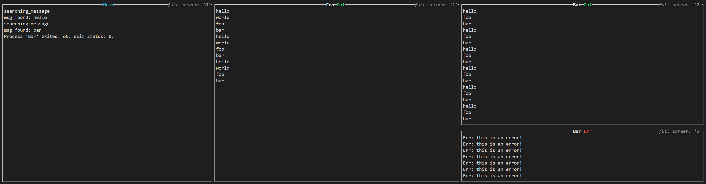

# process-terminal

[](https://crates.io/crates/process-terminal)

**process-terminal** is a Rust library built on top of [ratatui](https://github.com/ratatui-org/ratatui) that lets you visualize the outputs of one or more processes launched directly from your Rust code using [`std::process::Command`](https://doc.rust-lang.org/std/process/struct.Command.html).

The terminal interface is divided into two main sections:

- **Main Section (Left):** Displays the output of your main Rust application.
- **Processes Section (Right):** Automatically adjusts to show outputs from any processes you launch and add for visualization.

In addition, the library supports scrolling and offers a full screen mode to display a specific output. It also provides functionality to wait until a specific process emits an output (or a substring) before continuing execution in your main code.

## Features

- **Dual-Section Terminal UI:**
  - **Main Section:** For output from the main Rust script.
  - **Processes Section:** For outputs from processes spawned via `std::process::Command`.
- **Scrolling Support:** Easily scroll through the outputs.
- **Full Screen Mode:** Display a specific output in full screen.
- **Process Output Awaiting:** Wait for a specific output (or substring) from a process.

## How it looks like



```toml
[dependencies]
process-terminal = "0.1"
```

# Example

```rust
use {
    process_terminal::{
        KeyCode, MessageSettings, ProcessSettings, ScrollSettings, add_process,
        block_search_message, end_terminal, tprintln, utils::create_printing_process,
    },
    std::{thread::sleep, time::Duration},
};

fn main() {
    // Create a process that prints messages and sleeps.
    let process_foo = create_printing_process(["hello", "world", "foo", "bar"], 1.0, 30);

    // Add the process to the terminal.
    // The first time `add_process` or `tprintln!` is called, the terminal is automatically initialized.
    add_process(
        "Foo",
        process_foo,
        ProcessSettings::new_with_scroll(
            // Show only the output messages.
            MessageSettings::Output,
            // Enable scrolling with the Left and Right keys.
            // Up and Down keys are reserved for `Main` output.
            ScrollSettings::enable(KeyCode::Left, KeyCode::Right),
        ),
    )
    .unwrap();

    sleep(Duration::from_secs(2));

    // Create another process
    let process_bar = create_printing_process(
        ["hello", "Err: this is an error! >&2", "foo", "bar"],
        0.1,
        8,
    );

    add_process(
        "Bar",
        process_bar,
        // Show both output and error messages.
        ProcessSettings::new(MessageSettings::All),
    )
    .unwrap();

    sleep(Duration::from_secs(2));

    // Similar to print! and println!, but it prints messages in the `Main` section of the terminal.
    // I don't find a way to capture the stdout (like println!) and display them into `Main` section.
    tprintln!("searching_message");
    // Block the current thread until the message is found.
    let msg = block_search_message("Foo", "llo").unwrap();
    tprintln!("msg found: {}", msg);
    assert_eq!(msg, "hello");

    tprintln!("searching_message");
    let msg = block_search_message("Bar", "ar").unwrap();
    tprintln!("msg found: {}", msg);
    assert_eq!(msg, "bar");

    sleep(Duration::from_secs(20));

    // Restore the terminal to its original state.
    end_terminal();
}
```
